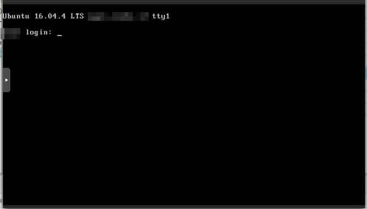

Pada artikel ini, saya akan menceritakan bagaimana saya berhasil menyelamankan dan mengembalikan paritisi LVM yang hilang metadatanya karena tertimpa oleh metadata SWAP.

Hal ini terjadi diduga karena sang "user" nampaknya ingin membesar kapasitas RAM dengan menambah ukuran SWAP. Alih-alih membuatnya pada suatu file atau partisi baru, si "user" tersebut membuatnya di partisi dimana _root disk_ berada. 

Sejurus kemudian, muncullah permintaan _reboot_ VM yang dimaksud. Tanpa pikir panjang, rekan saya melakukan _reboot_. Ditunggu beberapa saat kok tidak kunjung _UP_, diintiplah via console, dan _jeng-jeng-jeng_, sistem gagal booting dan _fallback_ ke initramfs dengan pesan error bahwa _logical volume_ untuk root partition tidak ditemukan.


## Pemecahan masalah

Melihat pesan error yang muncul pada saat booting tersebut, ada inidikasi bahwa root partition telah "rusak" dan sistem tidak mengenalinya lagi atau bahkan tidak menemukannya.

Kemudian, pengecekan menggunakan _Live Image ISO_ Ubuntu 18.04, bisa didapati bahwa susunan layout partisi adalah layout standar jika Ubuntu diinstall menggunakan opsi _Guided LVM_. yaitu partisi boot terpisah dan sisanya untuk LVM:


Saat dicek menggunakan `blkid`, tertulis bahwa `sda5` adalah partisi SWAP sedangkan `fdisk` menunjukkan bahwa `sda5` adalah partisi LVM. Dari sini saya berasumsi bahwa yang terjadi adalah sempat ada upaya untuk membuat partisi SWAP namun keliru dan menimpa metadata LVM pada partisi `sda5`.


Kemudian, saya coba untuk memuat partisi LVM tersebut dengan memindainya menggunakan `lvmdiskscan`. Dalam situasi normal dan ideal, seharusnya tool tersebut akan memberikan output seperti ini:

```
root@host:~# lvmdiskscan  | grep -v loop
  /dev/localhost/root [      16.27 GiB]
  /dev/sda1           [       1.40 GiB]
  /dev/localhost/swap [       2.33 GiB]
  /dev/sda5           [      23.60 GiB] LVM physical volume
  2 disks
  4 partitions
  0 LVM physical volume whole disks
  1 LVM physical volume
```

Dimana partisi LVM akan bisa dideteksi dan diidentifikasi. Jika demikian kondisinya, maka cukup dimuat dengan cara berikut:

```
# pvscan
# vgscan
# vgchange -ay
# mount ...
```

Namun kondisinya adalah, partisi yang ditengarai sebagai LVM tersebut tidak dikenali oleh sistem sebagai partisi LVM yang valid karena telah rusak metadatanya.


Bermodalkan dengan sedikit kemampuan _googling_, saya menemukan beberapa artikel yang menunjukkan bagaimana cara memulihkan partisi LVM2 beserta anak-anaknya (PV, VG, LV dan metadatanya). Diantara artikel yang paling membantu adalah [ini](https://www.golinuxcloud.com/recover-lvm2-partition-restore-vg-pv-metadata/).

Di artikel tersebut dijelaskan, yang pada intinya, bahwa hal yang berperan penting dalam pemulihan tersebut adalah file _backup metadata_ LVM, yang secara asal, selalu disimpan di `/etc/lvm/backup/<nama VG>`

Pertanyaannya, bagaimana cara mendapatkan file tersebut dalam keadaan file itu ada di dalam partisi yang "rusak" dan tidak bisa dimount tersebut?

Iseng-iseng saya coba untuk melakukan `less -sr` pada partisi yang dimaksud, dan hasilnya, partisi tersebut bisa dilihat bahwa file-file yang ada didalamnya bisa dibaca. Alhamdulillah, sebuah titik terang yang berarti file metadata yang dicari, seharusnya bisa "diambil".

## Berkenalan dengan sang tool "penyelamat"

Kembali menyelami tumpukan jerami google demi mencari sang "jarum", satu ketemulah satu forum yang sedang membahas permasalahan yang serupa (tapi berbeda). Salah satu jawabannya menjelaskan tentang tool `testdisk` yang mampu melakukan recovery file pada suatu partisi yang diduga "rusak" atau memang benar-benar rusak.


Singkat cerita, cukup dengan menjalankan `testdisk /dev/sda5`, kemudian dilakukan pemindaiaan, dan akhirnya muncul TUI (_Text-based User Interface_) seperti file explorer yang mana kita bisa eksplorasi file-file di dalam partisi yang sedang diperiksa tersebut, lengkap dengan struktur direktorinya juga! _Masya Allah_, mantap betul tool ini!


Dengan bantuan tool tersebut, file metadata backup yang dicari-pun berhasil untuk didapatkan!

## Pemulihan partisi LVM

Pembuatan ulang PV (_Physical Volumes_) kini bisa dilakukan dengan bermodalkan file backup tadi. Tetapi sebelunya perlu dicatat UUID dari partisi LVM yang hendak dibuat ulang tersebut. Ini bisa didapatkan dengan membuka file backup tadi, kemudian mencocokkannya dengan hasil UUID yang didapatkan via perintah `blkid`.


Pada bagian bawah tangkapan layar diatas, UUID yang dimaksud ada di bagian:

```
pv0 {
    id = UUID <----------------------- DISINI
    device = /dev/sda5 # Hint Only
...
```
Kemudian, copy UUID tersebut yang nantinya akan digunakan untuk membuat ulang partisi LVM. Perintahnya adalah seperti ini:

[](./lvm_pv-recreate.jpg)


```
pvcreate --restorefile <file backup> --uuid <uuid> /dev/sdaX
```

Dapat diperhatikan pada tangkapan layar sebelumnya, terdapat pesan _warning_ yang berbunyi "_swap signature detected on /dev/sda5_". Sehingga, memang benar dugaan kuat di awal terkait penyebab rusaknya partisi LVM ini.

Kemudian jika dicek menggunakan `pvs` atau `pvdisplay`, maka tentu PV yang dimaksud akan muncul.


Langkah selanjutnya adalah memulihkan VG (_Volume Group_) yang ada di dalam PV tersebut. Caranya cukup dengan menjalankan perintah berikut:

```
vgcfgrestore -f <file backup> <nama VG>
```


Kemudian aktifkan seluruh LV (_Logical Volumes_) yang ada di VG tersebut dengan cara:

```
vgchange -ay
```

Dengan demikian, jika dicek menggunakan `lvs` atau `lsblk`, maka akan muncul semua LV yang ada:


Nah, disini muncul permasalahan baru. Kenapa UUID untuk masing-masing LV kok tidak terlihat di output `lsblk` diatas? Dari sini sempat saya coba untuk `mount /dev/localhost/root /mnt` tetapi hasilnya gagal dengan error "...wrong fs type..."

Setelah ditelusuri lebih lanjut, jika melihat pada pesan error yang muncul saat mengaktifkan VG, ada indikasi bahwa partisi `/dev/sda5` memiliki ukuran sektor yang lebih kecil daripada ukuran PV. Maka, kemungkinannya adalah, dengan adanya perbedaan ukuran tersebut, tiap-tiap partisi LV, memiliki _starting_ sektor yang tergeser. Sehingga, metadata yang ada didalamnya tidak dikenali oleh sistem, dan UUID tidak muncul sebagaimana mestinya.

Setelah brainstorming dengan rekan senior saya, diputuskan untuk membuat ulang susunan partisi menggunakan `fdisk`. Singkatnya, saya hapus partisi 5 (lvm) kemudian partisi 2 (extended), setelah itu buat partisi baru lagi dengan susunan yang sama.


Dan perlu diperhatikan pula, saat membuat ulang partisi ke 5, jangan sampai menghapus **LVM2_member** signaturenya. Setelah itu, sistem perlu direboot karena partisi LVM tersebut masih "terpakai".

Kemudian, setelah reboot (setelah mengatur live cd, dst), maka sekarang tiap partisi LV sudah muncul UUIDnya. Nah, disini ketemu dengan permasalahan baru. Partisi `/dev/sda5` dan partisi `/dev/localhost/swap` memiliki UUID yang sama.


Disini cukup mudah. Tinggal saya buat ulang saja partisi SWAPnya menggunakan `mkswap /dev/localhost/swap`. Dengan demikian, partisi tersebut akan terlahir kembali dengan UUID baru.


Nah, sekarang pengujian akhir yaitu melakukan uji _mounting_ partisi root dengan `mount /dev/localhost/root /mnt`, dan hasilnya:


Disini saya cukup percaya diri bahwa sistem akan berhasil boot, maka langsung reboot saja.



_Alhamdulillah_, sistem berhasil dipulihkan!!

## Faidah yang bisa diambil

Dari kisah ini, ada beberapa hal penting yang bisa diambil pelajaran:

1. Backup data Anda! Seluruh aktivitas diatas terjadi karena tidak adanya backup. Dan perlu untuk ditekankan, bahwa backup seharusnya berada di tempat terpisah dengan objek backup.
1. File penting untuk sistem yang menggunakan _filesystem_ LVM salah satunya adalah file backup metadata yang terletak di `/etc/lvm/backup`.
1. Jangan lakukan sesuatu yang kita tidak tahu ilmunya, dan yang tidak pada tempatnya. Melakukan sesuatu pada _environment_ _production_ sama seperti berjalan di tepi jurang. Jika ragu, maka serahkan pada yang ahli.
1. Pentingnya skill _googling_ dalam pemecahan masalah. Perlu untuk mengetahui kata kunci yang tepat agar bisa mendapatkan hasil yang juga tepat sasaran. Menurut saya ini adalah skill utama untuk praktisi IT.

---

Sekian artikel kali ini. Semoga memberikan manfaat bagi pembaca, _barakallahufiikum_.
